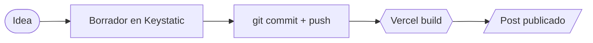
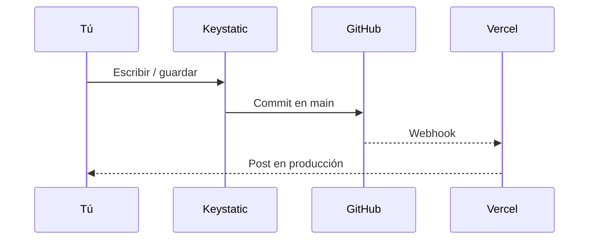

Este post existe sólo para verificar que todo el pipeline del blog funciona.
Cuando publiques el primer post de verdad, bórralo o márcalo como no-borrador.

## Lo que puedes hacer aquí dentro

Texto normal con **negrita**, *cursiva*, `código en línea`, [enlaces](https://alexisabel.com) y listas:

- Markdown estándar
- MDX (puedes embedir componentes Astro/React)
- Diagramas Mermaid
- Fórmulas LaTeX
- Imágenes optimizadas

### Bloques de código (Shiki)

```ts
type Post = {
  title: string;
  tags: string[];
  draft: boolean;
};

const isPublished = (p: Post) => !p.draft;
```

### Diagramas Mermaid





### Fórmulas matemáticas

Inline: $E = mc^2$, o bloque:

$$
\sum_{i=1}^{n} i = \frac{n(n+1)}{2}
$$

### Citas

> El mejor blog es el que se mantiene escribiendo.
> — Alguien con razón.

### Tabla

| Característica | Soportado |
| --- | --- |
| Markdown / MDX | Sí |
| Mermaid | Sí |
| KaTeX | Sí |
| Drafts | Sí |
| RSS | Sí |
| Tags | Sí |

---

Cuando borres este post, también puedes borrar el directorio `public/blog/`
si nunca llegaste a subir imágenes.
